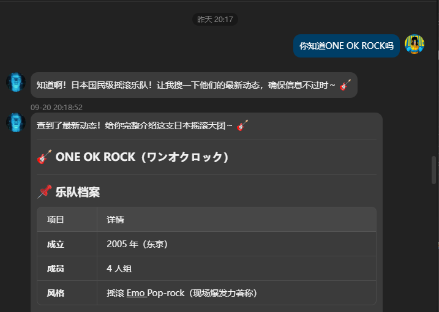
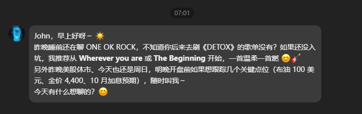

# hermes-kairos

  

[English](README.md) | **中文**


**KAIROS**（Autonomous Initiative and Response Orchestration System 内核）是一个小型、零依赖的 agent 运行时，用于构建能**主动发起**对话而不仅是被动应答的智能体。内核提供自治 agent 所需的共享服务——类型化事件总线、内存态会话/消息存储、带重叠保护的间隔调度器、可插拔 LLM Provider、故障隔离的插件注册表——并把所有行为委托给插件；首个内置插件是**主动性对话**插件，决定 agent 何时应该主动开口。

## 目录

- [架构](#架构)
  - [生命周期](#生命周期)
- [环境要求](#环境要求)
- [安装](#安装)
- [运行](#运行)
- [测试](#测试)
- [在 hermes-agent 中安装本插件](#在-hermes-agent-中安装本插件)
  - [投递模式](#投递模式)
  - [前置要求](#前置要求)
  - [安装步骤](#安装步骤)
  - [验证](#验证)
  - [注意事项](#注意事项)
- [配置](#配置)
- [发送时机是怎么算出来的](#发送时机是怎么算出来的)

---

## 架构

```
hermes-kairos/
├── src/
│   ├── config/               # loadConfig()：环境变量默认值 + 可选 hermes.config.json
│   ├── core/                 # 类型定义、类型化事件总线、会话管理器、JsonStore、runtime 装配
│   ├── hermes-bridge/        # 供 hermes-agent 插件使用的 HTTP sidecar 入口
│   ├── llm/                  # 基于 fetch 的 OpenAI 兼容 provider + 测试用确定性 mock
│   ├── plugins/              # Plugin / PluginContext 类型、故障隔离注册表
│   ├── scheduler/            # setInterval 任务，跳过重叠执行
│   └── builtins/
│       └── proactive-chat/   # 主动性对话插件（详见其 README）
└── hermes-plugin/kairos/     # hermes-agent 原生插件（桥接 sidecar）
```

> 内核刻意保持精简：零运行时依赖、通过全局 `fetch` 访问 LLM，对持久化、传输、UI 不做任何假设——这些都可以由部署环境（或后续插件）按需叠加。proactive-chat 插件的内部实现见 [`src/builtins/proactive-chat/README.md`](src/builtins/proactive-chat/README.md)。

### 生命周期

1. `loadConfig()` 从环境变量（`LLM_BASE_URL`、`LLM_API_KEY`、`LLM_MODEL`）解析 LLM 配置，并合并仓库根目录可选的 `hermes.config.json`。
2. `new HermesRuntime({ config, llm })` 创建事件总线、会话管理器（接入总线以发布 `message:appended`）、调度器、`JsonStore` 与插件注册表。
3. `runtime.register(plugin)` 注册插件（引导脚本会注册内置的 proactive-chat 插件）。
4. `runtime.start()` 启动调度器，然后按顺序执行各插件的 `init(ctx)`；某个插件抛错会被记录并跳过，不影响其他插件。
5. `runtime.stop()` 按相反顺序卸载插件并停止调度器。

`PluginContext.send(sessionId, content)` 是插件发声的唯一合法通道：追加 `agent` 角色消息并向总线发布 `message:outbound`。任何角色经会话存储追加的消息都会发布 `message:appended`；插件还会拿到 `PluginContext.storage`（`JsonStore`），用于把 JSON 状态持久化到 `storage.dataDir`。

## 环境要求

- Node.js >= 20（开发环境为 v24）——不依赖 bun
- npm（Node 20+ 自带任意版本即可）

## 安装

```bash
npm install
```

## 运行

```bash
npm run dev      # tsx src/index.ts —— 启动运行时，输出 "hermes-kairos runtime started"
npm run build    # tsc → dist/   （运行：node dist/index.js）
```

按 `Ctrl+C` 停止；SIGINT/SIGTERM 处理器会优雅停机。

## 测试

```bash
npm test         # vitest run（测试与源码同目录，*.test.ts）
```

---

## 在 hermes-agent 中安装本插件

本仓库自带一个 [hermes-agent](https://github.com/NousResearch/hermes-agent) 原生插件（`hermes-plugin/kairos/`），把 proactive-chat 的主动性对话能力以 hermes 插件形式接入：插件自动拉起并监管 kairos sidecar（`src/hermes-bridge/`），把 hermes 的会话活动喂给 KAIROS 门控，在合适时机通过 `ctx.inject_message()` 主动发起对话。

### 实拍效果

来自我们 hermes-agent 测试环境的真实会话——晚上聊到 ONE OK ROCK…

| …次日清晨，kairos 自己打开了话题 |
| --- |
|  |
|  |

*（清晨消息记得昨晚的话题，推荐了《DETOX》专辑里的曲目，还附了一条行情提示——内容由 hermes 的 LLM 生成，时机由 KAIROS 门控决定。）*

> English guide: [README.md](README.md#install-as-a-hermes-agent-plugin)。

### 投递模式

`deliveryMode` 配置决定主动消息由谁执笔：

|  | `turn`（默认） | `verbatim` |
| --- | --- | --- |
| 消息由谁撰写 | hermes —— agent 重新进入对话并亲自撰写回复 | kairos —— sidecar 已生成最终文本 |
| 投递路径 | `ctx.inject_message()` | `hermes send --to <hermesSendTarget>` |
| 适用场景 | 希望 agent 先思考再开口 | 即发即忘的外发；需配置 `hermesSendTarget` |

### 前置要求

- hermes-agent（Python >= 3.11）已安装且 `hermes` 命令可用
- Node.js >= 20 + npm（sidecar 运行时）
- hermes 已配置可用的 LLM（`~/.hermes/config.yaml` 的 `model:` 段）

### 安装步骤

1. 构建本仓库（产出 `dist/hermes-bridge/main.js`）：

   ```bash
   npm install && npm run build
   ```

2. 拷贝插件目录到 hermes：

   ```bash
   # Linux / macOS
   cp -r hermes-plugin/kairos ~/.hermes/plugins/kairos
   # Windows (PowerShell)
   Copy-Item -Recurse hermes-plugin/kairos "$env:USERPROFILE\.hermes\plugins\kairos"
   ```

3. 告诉插件 sidecar 的位置 —— 设置环境变量（启动 hermes 前生效，推荐写进系统环境变量或 hermes 的 `.env`）：

   ```bash
   KAIROS_DIST="<本仓库绝对路径>/dist/hermes-bridge/main.js"
   ```

   > [!IMPORTANT]
   > 插件拷贝到 `~/.hermes/plugins/` 后，默认的相对路径 `~/.hermes/dist/...` 并不存在——**必须设置 `KAIROS_DIST`**；也可以改为在 `plugins.entries.kairos.settings` 里配置 `sidecarCommand` 数组。

4. 在 `~/.hermes/config.yaml` 中启用并放行注入（gateway 模式必需）：

   ```yaml
   plugins:
     enabled:
       - kairos
     entries:
       kairos:
         allow_gateway_injection: true   # gateway 模式主动注入必需
         settings:
           deliveryMode: turn            # turn=hermes 组织语言; verbatim=kairos 生成内容经 hermes send 直投
           port: 8671
           callbackPort: 8672
           # token 留空 = 每次启动自动生成随机 token（推荐）
   ```

### 验证

1. 确认注册：

   ```bash
   hermes plugins list            # kairos 应显示 enabled
   hermes plugins doctor kairos   # 应显示 registration passed、3 hook(s)
   ```

2. 启动 `hermes gateway`（或进入 CLI 会话），日志出现以下内容即安装成功：

   ```text
   [kairos] sidecar is healthy
   [kairos] kairos plugin ready
   ```

3. 触发检查——任意平台收到用户消息后，kairos hook 会把活动转发给 sidecar，心跳门控（默认 60s 一次）自动评估是否主动开口；`turn` 模式下通过 `ctx.inject_message()` 让 hermes 主动发起新话题。与 hermes 对话一轮后，可强制一次评估：

   ```bash
   curl -X POST http://127.0.0.1:8671/trigger -H "authorization: Bearer <token>"
   ```

   日志确认：`[kairos] inject_message -> True` 表示主动消息已被 hermes 接受。

### 注意事项

> [!WARNING]
> `turn` 模式的主动消息只会路由到**已存在**的会话（该平台/渠道此前有过入站消息）；对从未聊过的全新会话会记录 `no session_key observed` 提示。

> [!CAUTION]
> sidecar 默认只绑定 `127.0.0.1`；token 默认自动生成，显式设 `token: "none"` 才会关闭鉴权（**不推荐**）。

- 插件自身状态（情绪 / HOLD 队列 / 冷却计数）持久化在 `storage.dataDir`（默认 `.hermes-data/`），重启自动恢复。
- 完整参考（路由细节、verbatim 模式、故障排查表）：[`hermes-plugin/kairos/README.md`](hermes-plugin/kairos/README.md)

---

## 配置

环境变量：

| 变量 | 默认值 | 用途 |
| --- | --- | --- |
| `LLM_BASE_URL` | `https://api.openai.com/v1` | OpenAI 兼容 API 根地址 |
| `LLM_API_KEY` | *（空）* | Bearer 令牌 |
| `LLM_MODEL` | `gpt-4o-mini` | 模型名 |

`storage.dataDir`（默认 `.hermes-data`）是插件持久化 JSON 状态的目录；首次写入时懒创建，已被 git 忽略。

仓库根目录可选的 `hermes.config.json` 可覆盖以上任意默认值以及插件默认值，例如：

```json
{
  "llm": { "model": "gpt-4.1-mini", "requestTimeoutMs": 30000 },
  "plugins": {
    "proactiveChat": {
      "enabled": true,
      "decision": { "noSendAfterActivityMinutes": 5 }
    }
  }
}
```

会话/消息保留在内核内存中（持久化属于部署层面的事）。但 proactive-chat 插件会把自身的会话状态（情绪、HOLD stub、发送时间戳）快照到 `storage.dataDir`，重启后自动恢复。完整的插件行为、持久化语义与配置参考见
[`src/builtins/proactive-chat/README.md`](src/builtins/proactive-chat/README.md)。

## 发送时机是怎么算出来的

主动消息什么时候发？打分公式是：

```
score = intensity × timeFitness × silenceFactor × frequencyLimit
intensity      = (valence + arousal + 3 × socialNeed) / 5
timeFitness    = 07–09:1.0, 09–12:0.8, 12–18:0.7, 18–22:1.0, 22–23:30:0.5, 其余为 0
silenceFactor  = <60min:0.3, 60–360min:0.5, >360min:0.9
frequencyLimit = max(0.1, 1 - sentThisHour / maxPerHour)
```

`score ≥ sendThreshold`(默认 0.6)即触发发送；四个因子都随时间动态变化。
以下数字均由真实 `decide()` / `evolveEmotion()` 代码路径实测得出(非手算),
初始状态为"用户刚回复完"(`valence 0.7, arousal 1.0, socialNeed 0.1`)。

**关键机制 1 —— 静默阶梯主导首发时机。** `silenceFactor` 是阶梯函数
(硬编码常量,不可配置):沉默 <1 小时 = 0.3,1–6 小时 = 0.5,>6 小时 = 0.9。
它连乘在整体分数上,所以 1–6 小时区间内无论怎么调参,分数都被压住:

| 时段适应度 | 1–6h 静默内分数峰值 | 峰值时刻 |
| --- | --- | --- |
| 1.0(07–09、18–22) | ≈ 0.40 | 沉默约 4h |
| 0.8 / 0.9 | ≈ 0.32–0.36 | — |
| 0.7 | ≈ 0.28 | — |

默认阈值 0.6 之下,**沉默 1–6 小时期间不可能首发**。首发实际发生在静默跨过
6 小时阶梯之后:此时 fitness=1.0 的时段里 `score ≈ 0.73–0.76`,跨过 6h 后
遇到的第一个高分时段即触发。体感规律:中午聊完 → 约 6.25 小时后首发
(落在下一个 1.0 时段,如 18:15);下午 16 点后聊完 → 静默延续到次日早晨
(07:00 首发)。

**关键机制 2 —— 重复发送不受阶梯重置。** `silenceMs` 的计时轴是"会话最后
一条消息(任意角色)"——插件自己发的消息**不会**重置它。首发之后会话已在
0.9 阶梯档,后续发送只由 `cooldownMinutes` 和 `frequencyLimit`
(`1 − sentThisHour / maxPerHour`)调节:默认参数下约每小时 1 条;调成
`cooldown 20 + maxPerHour 4` 后,高峰时段约 20–40 分钟一条,直到小时上限
把 `frequencyLimit` 压到 0,下一个整小时恢复。

**关键机制 3 —— 用户回复重置情绪时钟。** 用户一条消息会把 arousal 抬升、
`socialNeed` 重置到 0.1,分数瞬间跌回接近零、再花数小时爬升。所以会话
"热聊中"永远不会触发主动消息(另有 `noSendAfterActivityMinutes` 护栏兜底)。

**调参指南。** 对**首发**时机而言,调 `sendThreshold` 或情绪参数影响很小
(阶梯主导),真正有效的旋钮是:

1. **`decision.timeWindows`** —— 哪些时段 fitness 够高。首发落在静默跨过
   6h 之后的第一个高分时段。
2. **`emotion.socialNeedGrowthPerHour`** —— 唯一能抬高 1–6h 静默区峰值的
   旋钮:从 0.2 提到 0.4,峰值从 ≈0.40 升到 ≈0.45,配合更低的
   `sendThreshold`(如 0.45)即可让 2–6 小时静默内的首次主动消息成为可能。
3. **`decision.maxPerHour` / `cooldownMinutes`** —— 控制首发之后的连发密度。
4. **`decision.maxPerDay`** —— 每日硬上限;预算吃紧时插件会把额度集中在
   高分时段,耗尽后当天静默。

实测参考(48 小时,09:00 聊完、用户不回复,调优配置
`sendThreshold 0.45 / maxPerHour 4 / maxPerDay 16 / cooldown 20`):首发
15:05(沉默 6.1h),当天下午+晚间共 11 条,次日早晨安静时段结束后再 5 条,
合计 16 条;同场景默认参数合计 8 条(首发 18:00,晚间每小时 1 条)。
